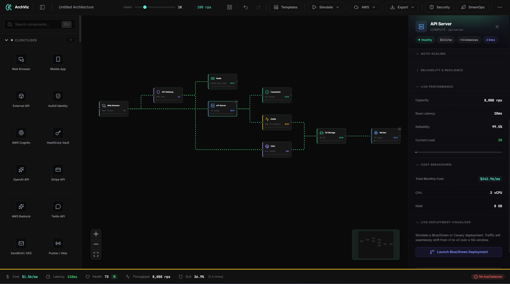
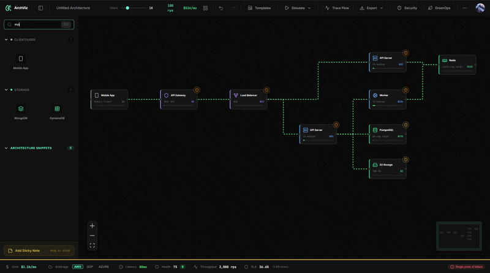

<p align="center">
  
  
  
  
  
  
</p>

<h1 align="center">🧠 ArchViz — System Architecture Design Engine</h1>

<p align="center">
  <strong>Design. Simulate. Optimize. Export.</strong><br/>
  A visual system architecture simulator with real-time cost estimation, traffic simulation, bottleneck detection, security scanning, and Infrastructure-as-Code export — all running locally in your browser.
</p>

<p align="center">
  <a href="https://archviz-studio.vercel.app" target="_blank">
    
  </a>
</p>

<p align="center">
  <a href="https://www.producthunt.com/products/archviz?embed=true&amp;utm_source=badge-featured&amp;utm_medium=badge&amp;utm_campaign=badge-archviz" target="_blank" rel="noopener noreferrer"></a>
</p>

<p align="center">
  <a href="https://archviz-studio.vercel.app" target="_blank">
    
  </a>
</p>

<p align="center">
  
</p>

<p align="center">
  <a href="#-features">Features</a> •
  <a href="#-simulation-engine">Simulation Engine</a> •
  <a href="#-component-library">Components</a> •
  <a href="#-architecture">Architecture</a> •
  <a href="#-getting-started">Getting Started</a> •
  <a href="#-testing">Testing</a> •
  <a href="#-tech-stack">Tech Stack</a>
</p>

---

## ✨ Features

### 🏗️ Infrastructure-as-Code (IaC) Export
*The core engine of ArchViz. Transition from visual design to deployable infrastructure instantly.*
- **Terraform (HCL)** — Generates full AWS provider configurations, VPC scaffolds, subnets, and meticulously mapped resource blocks.
- **CloudFormation (JSON)** — Native AWS templates with automated parameters, IAM definitions, and logical groupings.
- **Production-Ready** — Ensures correct resource naming conventions, proper tagging mechanisms, and implicit dependency mapping.
- **Zero-Touch Provisioning** — Code outputs are guaranteed valid; simply run `terraform plan` and `terraform apply`.

### 🎨 Visual Architecture Designer
- **Drag-and-drop** 40+ real AWS/cloud components onto an infinite canvas
- **Smart connections** with architectural anti-pattern detection
- **Group/Boundary nodes** for network isolation (VPCs, domains)
- **Auto-layout** using Dagre algorithms for structured topologies

### 📊 Real-Time Simulation Engine
- **Live cost estimation** using real AWS on-demand pricing scenarios
- **Traffic simulation** with configurable continuous RPS multipliers
- **Bottleneck detection** — identifies load saturation points in real time
- **Health scoring** — composite metrics calculating overall availability SLA (nines)

### 🔒 Security Scanner & Validation
- Automated **compliance scanning** against SOC2, HIPAA, PCI-DSS, and GDPR standards
- **Anti-pattern rules** block invalid links (e.g., generic Frontend direct to Database)
- Detects lacking encryption policies, public exposure, and high-risk vectors

---

## 🔬 Simulation Engine

The simulation engine is composed of 13 specialized modules:

```
┌─────────────────────────────────────────────────────────┐
│                    Simulator (Orchestrator)              │
│                                                         │
│  ┌──────────────┐  ┌──────────────┐  ┌───────────────┐  │
│  │ Traffic Model │  │ Cost Engine  │  │ Latency Model │  │
│  │ RPS / Users   │  │ AWS Pricing  │  │ E2E Latency   │  │
│  └──────────────┘  └──────────────┘  └───────────────┘  │
│                                                         │
│  ┌──────────────┐  ┌──────────────┐  ┌───────────────┐  │
│  │  Bottleneck  │  │ Failure Model│  │   Scaling     │  │
│  │  Detector    │  │ Reliability  │  │   Model       │  │
│  └──────────────┘  └──────────────┘  └───────────────┘  │
│                                                         │
│  ┌──────────────┐  ┌──────────────┐  ┌───────────────┐  │
│  │    SLA       │  │  Security    │  │ Recommendation│  │
│  │ Calculator   │  │  Scanner     │  │    Engine     │  │
│  └──────────────┘  └──────────────┘  └───────────────┘  │
│                                                         │
│  ┌──────────────┐  ┌──────────────┐  ┌───────────────┐  │
│  │  Connection  │  │  Terraform   │  │  Auto Layout  │  │
│  │  Validator   │  │  Generator   │  │  (Dagre)      │  │
│  └──────────────┘  └──────────────┘  └───────────────┘  │
│                                                         │
│                  ┌──────────────┐                        │
│                  │ CloudFormation│                        │
│                  │  Generator   │                        │
│                  └──────────────┘                        │
└─────────────────────────────────────────────────────────┘
```

### Cost Engine
Calculates monthly cost per component factoring in:
- Instance tier (real AWS pricing: t3.micro → m5.4xlarge)
- Horizontal scaling (instance count)
- Volume type multipliers (gp3, io1, magnetic)
- Multi-AZ premium (1.5x)
- Pricing models: On-Demand, Savings Plan (-30%), Reserved (-50%), Spot (-70%)
- Read replica costs for databases (~70% per replica)

### SLA Calculator
- Computes **composite SLA** across critical path
- Calculates **nines** (e.g., 99.95% = 3.3 nines)
- Estimates **annual and monthly downtime**
- Identifies **weakest link** in your architecture

---

## 🧩 Component Library

**40+ components** across 7 categories with real AWS pricing:

| Category | Components |
|---|---|
| **Client** | Web Browser, Mobile App, External API, Auth0, Cognito, Vault, OpenAI API, Stripe |
| **Compute** | API Server, Web Server, Worker, Lambda, WebSocket, ECS Fargate, App Runner, K8s (EKS), Cloudflare Workers, GraphQL Server, Game Server, ML/GPU Worker, Batch Job |
| **Storage** | PostgreSQL, MySQL, MongoDB, Redis, S3, Cassandra, DynamoDB, Elasticsearch, Pinecone Vector DB, Snowflake, Bigtable/Spanner |
| **Network** | Load Balancer (ALB), CDN (CloudFront), API Gateway, NAT Gateway, Route 53, WAF/Firewall, Transit Gateway |
| **Messaging** | SQS, SNS, Kafka (MSK), RabbitMQ, EventBridge |
| **Observability** | CloudWatch, DataDog |
| **Boundary** | VPC, Public/Private Subnet, Security Group, Availability Zone |

Each component includes:
- Multiple **tier options** with real pricing (e.g., `db.t3.micro` at $15.33/mo → `db.r6g.4xlarge` at $700.80/mo)
- **Capacity** (requests/sec per instance)
- **Latency** characteristics
- **Reliability** rating (0–1)
- **Scaling type** (horizontal/vertical)

---

## 🏛️ Architecture

```text
src/
├── components/          # React UI components
│   ├── auth/            # Auth components (LoginModal)
│   ├── dashboard/       # Cloud dashboard & project cards
│   ├── panels/          # Node configuration panels
│   ├── nodes/           # Custom ReactFlow nodes (ArchNode, GroupNode)
│   ├── edges/           # Custom ReactFlow edges
│   ├── workspace/       # Workspace items (ZoneNode)
│   ├── LandingPage.tsx  # Marketing landing page
│   └── ...              # Layouts, Overlays, Modals, Toasts
│
├── engine/              # Pure-logic simulation modules
│   ├── simulator.ts     # Orchestrator — runs all engines
│   ├── costEngine.ts    # AWS pricing calculations
│   ├── carbonEngine.ts  # Carbon footprint estimation
│   ├── deploymentSimulator.ts # CI/CD rollout simulation
│   ├── securityScanner.ts  # Compliance scanning
│   ├── terraformGenerator.ts # IaC export
│   └── ...              # Traffic, latency, bottlenecks, auto-layout
│
├── store/               # Zustand state management
│   ├── useArchStore.ts  # Architecture & graph state
│   └── useAuthStore.ts  # Firebase user & session state
│
├── hooks/               # Custom React hooks
│   ├── useAuth.ts             # Firebase auth abstraction
│   ├── useDeploymentSimulator.ts # CI/CD deployment context
│   └── ...              # Simulation, events, validation
│   
├── lib/
│   └── firebase.ts      # Firebase initialization & config
│
├── services/
│   └── projectService.ts # Cloud database operations
│
├── utils/
│   ├── validationSchemas.ts   # Zod schemas for validation
│   └── templateLoader.ts      # Architecture template parser
│
├── data/
│   ├── componentLibrary.ts    # 40+ component definitions
│   └── templates/             # Starter templates, snippets
│
├── types/
│   └── index.ts               # TypeScript generic typings
│
├── tests/                     # Vitest test suites
│   ├── costEngine.test.ts
│   ├── connectionValidator.test.ts
│   └── ...
│
└── styles/
    ├── auth-dashboard.css     # Web portal styling
    ├── index.css              # Obsidian design system core
    ├── landing.css            # Landing page styles
    └── reactflow.css          # Canvas overrides
```

### State Management
Application state is highly segregated into discrete **Zustand stores**:
- **`useArchStore`**: Graph state (nodes/edges), undo/redo stack, and simulation config.
- **`useAuthStore`**: Global user session, auth initialization state, and cloud database mapping.

---


### Test Coverage

| Suite | Tests | Coverage |
|---|---|---|
| `costEngine.test.ts` | 16 | Pricing models, volume types, multi-AZ, replicas, scaling, formatting |
| `connectionValidator.test.ts` | 8 | Anti-pattern detection, allowed/blocked connections, warnings |
| `terraformGenerator.test.ts` | 14 | HCL generation, resource mapping, VPC scaffold, CloudFormation |
| `validationSchemas.test.ts` | 31 | All Zod schemas, boundary values, edge cases, error messages |
| **Total** | **69** | |

---

## 🛠️ Tech Stack

| Layer | Technology |
|---|---|
| **Framework** | React 19 + TypeScript 5 |
| **Build** | Vite 6 |
| **State** | Zustand 5 |
| **Canvas** | @xyflow/react (ReactFlow) |
| **Routing** | React Router DOM 7 |
| **Validation** | Zod 4 |
| **Graph Layout** | @dagrejs/dagre |
| **Icons** | Lucide React |
| **Image Export** | html-to-image |
| **Testing** | Vitest + React Testing Library |
| **Styling** | Vanilla CSS (Midnight Obsidian design system) |

---


## 📄 License

**© Copyright**. This project is copyrighted material, licensed under the **MIT License**.

---

<p align="center">
  <strong>Built for elite system designers.</strong><br/>
  <sub>Design your architecture before you write a single line of code.</sub>
</p>
